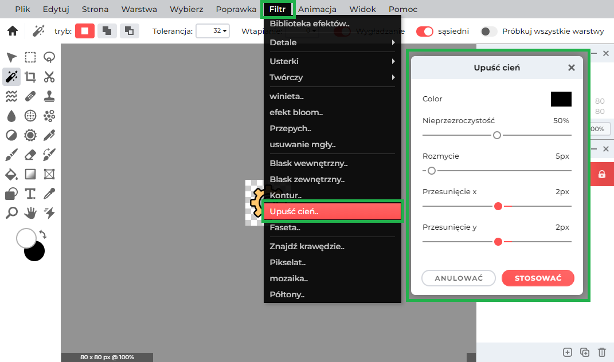

# smart-words / frontend / menu items

This folder contains all menu item icons for three different states: enabled, disabled, and hovered.

### how to create hover image?

To create a new menu item one may use different offline and online image editors but in this example a Pixlr E online image editor will be used. It's completely free to use and it allows to 5 exports per day.

1. To open the editor go to: [Pixlr E HOME PAGE](https://pixlr.com/pl/e/) 

2. Open a new image to load it into canvas

3. resize the canvas to match other menu item icons

4. add shadow effect

5. adjust colors

After the above modification a ready-to-go hover icon can be exported. The original icon should be used as a enabled version of the image. The disabled icon should be completely transparent and it should not contain any colors.